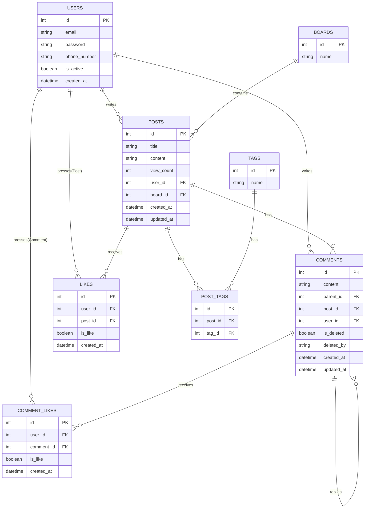

# Team Board API

본 프로젝트는 팀 협업을 위한 게시판 API 서비스입니다.

---

## 📝 User Requirements (사용자 요구사항 정의서)

### 사용자 유형
| 유형 | 설명 |
|------|------|
| 비회원 | 로그인하지 않은 사용자 |
| 회원 | 로그인한 사용자 |
| 관리자 | 관리 권한을 가진 사용자 |

---

### 인증
| ID | 사용자 | 요구사항 | 우선순위 |
|----|--------|----------|----------|
| REQ-01 | 비회원 | 이메일과 비밀번호로 회원가입을 할 수 있다 | 상 |
| REQ-02 | 비회원 | 이메일은 중복 가입이 불가능하다 | 상 |
| REQ-03 | 비회원 | 이메일과 비밀번호로 로그인을 할 수 있다 | 상 |
| REQ-04 | 회원 | Refresh Token으로 Access Token을 재발급 받을 수 있다 | 중 |

---

### 게시글
| ID | 사용자 | 요구사항 | 우선순위 |
|----|--------|----------|----------|
| REQ-05 | 비회원 | 게시글 목록을 조회할 수 있다 | 상 |
| REQ-06 | 비회원 | 게시글 상세 내용을 조회할 수 있다 | 상 |
| REQ-07 | 비회원 | 게시글 조회 시 조회수가 증가한다 | 중 |
| REQ-08 | 회원 | 게시글을 작성할 수 있다 | 상 |
| REQ-09 | 회원 | 본인이 작성한 게시글을 수정할 수 있다 | 상 |
| REQ-10 | 회원/관리자 | 본인이 작성한 게시글 또는 관리자는 모든 게시글을 삭제할 수 있다 | 상 |

---

### 좋아요/싫어요
| ID | 사용자 | 요구사항 | 우선순위 |
|----|--------|----------|----------|
| REQ-11 | 회원 | 게시글에 좋아요를 누를 수 있다 | 중 |
| REQ-12 | 회원 | 게시글에 싫어요를 누를 수 있다 | 중 |
| REQ-13 | 회원 | 좋아요/싫어요를 다시 누르면 취소된다 | 중 |
| REQ-14 | 회원 | 좋아요 상태에서 싫어요를 누를 수 없다 (반대도 동일) | 중 |
| REQ-15 | 회원 | 댓글에 좋아요를 누를 수 있다 | 중 |
| REQ-16 | 회원 | 댓글에 싫어요를 누를 수 있다 | 중 |

---

### 댓글
| ID | 사용자 | 요구사항 | 우선순위 |
|----|--------|----------|----------|
| REQ-17 | 비회원 | 게시글의 댓글 목록을 조회할 수 있다 | 상 |
| REQ-18 | 회원 | 게시글에 댓글을 작성할 수 있다 | 상 |
| REQ-19 | 회원 | 본인이 작성한 댓글을 수정할 수 있다 | 중 |
| REQ-20 | 회원/관리자 | 본인이 작성한 댓글 또는 관리자는 모든 댓글을 삭제할 수 있다 | 상 |
| REQ-21 | 회원 | 댓글에 대댓글을 작성할 수 있다 | 중 |
| REQ-22 | 비회원 | 댓글의 대댓글 목록을 조회할 수 있다 | 중 |
| REQ-23 | - | 삭제된 댓글은 삭제 주체에 따라 다른 메시지로 표시된다 | 중 |

---

### 게시판
| ID | 사용자 | 요구사항 | 우선순위 |
|----|--------|----------|----------|
| REQ-24 | 비회원 | 게시판 목록을 조회할 수 있다 | 상 |
| REQ-25 | 비회원 | 게시판 상세 내용을 조회할 수 있다 | 상 |
| REQ-26 | 비회원 | 특정 게시판의 게시글 목록을 조회할 수 있다 | 상 |
| REQ-27 | 관리자 | 게시판을 생성할 수 있다 | 상 |
| REQ-28 | 관리자 | 게시판을 수정할 수 있다 | 중 |
| REQ-29 | 관리자 | 게시판을 삭제할 수 있다 | 중 |

---

### 태그
| ID | 사용자 | 요구사항 | 우선순위 |
|----|--------|----------|----------|
| REQ-30 | 회원 | 게시글 작성 시 태그를 등록할 수 있다 | 중 |
| REQ-31 | 회원 | 태그는 여러 개 등록할 수 있다 | 중 |
| REQ-32 | 회원 | 본인이 작성한 게시글의 태그를 수정할 수 있다 | 중 |
| REQ-33 | 비회원 | 특정 태그가 달린 게시글 목록을 조회할 수 있다 | 중 |

---

### 인기글
| ID | 사용자 | 요구사항 | 우선순위 |
|----|--------|----------|----------|
| REQ-34 | 비회원 | 조회수 기준 상위 N개의 게시글을 조회할 수 있다 | 중 |
| REQ-35 | 비회원 | 좋아요 수 기준 상위 N개의 게시글을 조회할 수 있다 | 중 |

---

### 검색/페이지네이션
| ID | 사용자 | 요구사항 | 우선순위 |
|----|--------|----------|----------|
| REQ-36 | 비회원 | 게시글 목록을 페이지 단위로 조회할 수 있다 | 중 |
| REQ-37 | 비회원 | 제목으로 게시글을 검색할 수 있다 | 중 |
| REQ-38 | 비회원 | 내용으로 게시글을 검색할 수 있다 | 중 |
| REQ-39 | 비회원 | 작성자 이메일로 게시글을 검색할 수 있다 | 중 |
| REQ-40 | 비회원 | 특정 게시판 내에서 게시글을 검색할 수 있다 | 중 |

---

## 🗂 Database Design (ERD)

---

## 주요 설계 원칙
1. **정규화 및 관계 정의**: USERS, BOARDS, POSTS, COMMENTS 엔티티 간의 관계를 명확히 정의하여 데이터 중복을 최소화했습니다.
2. **확장 가능한 게시판 구조**: BOARDS 테이블을 분리하여 향후 게시판 유형이 추가되어도 시스템 구조 변경 없이 유연하게 확장 가능합니다.
3. **데이터 무결성 (CASCADE)**: POSTS 삭제 시 관련 COMMENTS가 고아 데이터로 남지 않도록 CASCADE 옵션을 적용하였습니다.
4. **대댓글 및 좋아요 기능**:
   - Self-referencing: COMMENTS 테이블 내 parent_id를 통해 계층형 대댓글 구조를 구현했습니다.
   - Soft Delete: 댓글 삭제 시 물리적 삭제 대신 `deleted_by` 필드로 삭제 주체(작성자/관리자)를 기록하여 대화 맥락을 유지하도록 설계했습니다.
   - 중복 방지: LIKES 및 COMMENT_LIKES 테이블에 복합 유니크 제약을 설정하여 사용자당 좋아요/싫어요 1회 제한 정책을 강제했습니다.

---

## 📋 Table Definition (테이블 정의서)

### USERS
| 컬럼명 | 타입 | 제약조건 | 설명 |
|--------|------|----------|------|
| id | INTEGER | PK, AUTO_INCREMENT | 사용자 고유 ID |
| email | VARCHAR | UNIQUE, NOT NULL | 이메일 (로그인 ID) |
| hashed_password | VARCHAR | NOT NULL | 암호화된 비밀번호 |
| phone_number | VARCHAR | NULL | 전화번호 |
| is_active | BOOLEAN | DEFAULT TRUE | 계정 활성화 여부 |
| created_at | DATETIME | DEFAULT NOW | 가입일시 |

---

### BOARDS
| 컬럼명 | 타입 | 제약조건 | 설명 |
|--------|------|----------|------|
| id | INTEGER | PK, AUTO_INCREMENT | 게시판 고유 ID |
| name | VARCHAR | NOT NULL | 게시판 이름 |
| created_at | DATETIME | DEFAULT NOW | 생성일시 |

---

### POSTS
| 컬럼명 | 타입 | 제약조건 | 설명 |
|--------|------|----------|------|
| id | INTEGER | PK, AUTO_INCREMENT | 게시글 고유 ID |
| title | VARCHAR(200) | NOT NULL | 게시글 제목 |
| content | TEXT | NOT NULL | 게시글 내용 |
| user_id | INTEGER | FK(USERS.id), NOT NULL | 작성자 ID |
| board_id | INTEGER | FK(BOARDS.id), NULL | 게시판 ID |
| view_count | INTEGER | DEFAULT 0 | 조회수 |
| created_at | DATETIME | DEFAULT NOW | 작성일시 |
| updated_at | DATETIME | NULL | 수정일시 |

---

### COMMENTS
| 컬럼명 | 타입 | 제약조건 | 설명 |
|--------|------|----------|------|
| id | INTEGER | PK, AUTO_INCREMENT | 댓글 고유 ID |
| content | TEXT | NOT NULL | 댓글 내용 |
| user_id | INTEGER | FK(USERS.id), NOT NULL | 작성자 ID |
| post_id | INTEGER | FK(POSTS.id), NOT NULL | 게시글 ID |
| parent_id | INTEGER | FK(COMMENTS.id), NULL | 부모 댓글 ID (대댓글인 경우) |
| is_deleted | BOOLEAN | DEFAULT FALSE | 삭제 여부 |
| deleted_by | VARCHAR | NULL | 삭제 주체 (user/admin) |
| created_at | DATETIME | DEFAULT NOW | 작성일시 |
| updated_at | DATETIME | NULL | 수정일시 |

---

### LIKES
| 컬럼명 | 타입 | 제약조건 | 설명 |
|--------|------|----------|------|
| id | INTEGER | PK, AUTO_INCREMENT | 좋아요 고유 ID |
| user_id | INTEGER | FK(USERS.id), NOT NULL | 사용자 ID |
| post_id | INTEGER | FK(POSTS.id), NOT NULL | 게시글 ID |
| is_like | BOOLEAN | NOT NULL | 좋아요(TRUE) / 싫어요(FALSE) |
| created_at | DATETIME | DEFAULT NOW | 생성일시 |

> UNIQUE(user_id, post_id) — 한 사용자가 한 게시글에 한 번만 가능

---

### COMMENT_LIKES
| 컬럼명 | 타입 | 제약조건 | 설명 |
|--------|------|----------|------|
| id | INTEGER | PK, AUTO_INCREMENT | 좋아요 고유 ID |
| user_id | INTEGER | FK(USERS.id), NOT NULL | 사용자 ID |
| comment_id | INTEGER | FK(COMMENTS.id), NOT NULL | 댓글 ID |
| is_like | BOOLEAN | NOT NULL | 좋아요(TRUE) / 싫어요(FALSE) |
| created_at | DATETIME | DEFAULT NOW | 생성일시 |

> UNIQUE(user_id, comment_id) — 한 사용자가 한 댓글에 한 번만 가능

---

### TAGS
| 컬럼명 | 타입 | 제약조건 | 설명 |
|--------|------|----------|------|
| id | INTEGER | PK, AUTO_INCREMENT | 태그 고유 ID |
| name | VARCHAR | UNIQUE, NOT NULL | 태그 이름 |

---

### POST_TAGS
| 컬럼명 | 타입 | 제약조건 | 설명 |
|--------|------|----------|------|
| id | INTEGER | PK, AUTO_INCREMENT | 고유 ID |
| post_id | INTEGER | FK(POSTS.id), NOT NULL | 게시글 ID |
| tag_id | INTEGER | FK(TAGS.id), NOT NULL | 태그 ID |

> UNIQUE(post_id, tag_id) — 같은 게시글에 같은 태그 중복 불가
